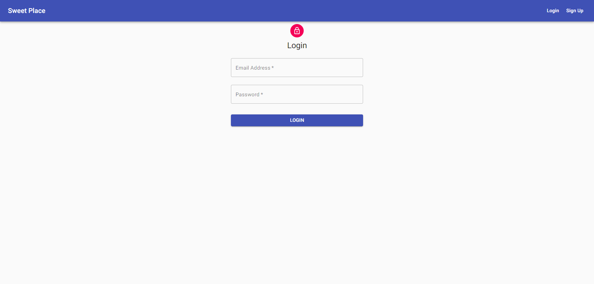
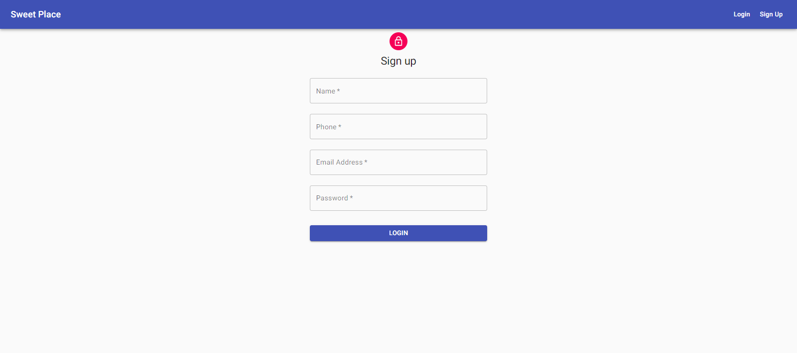
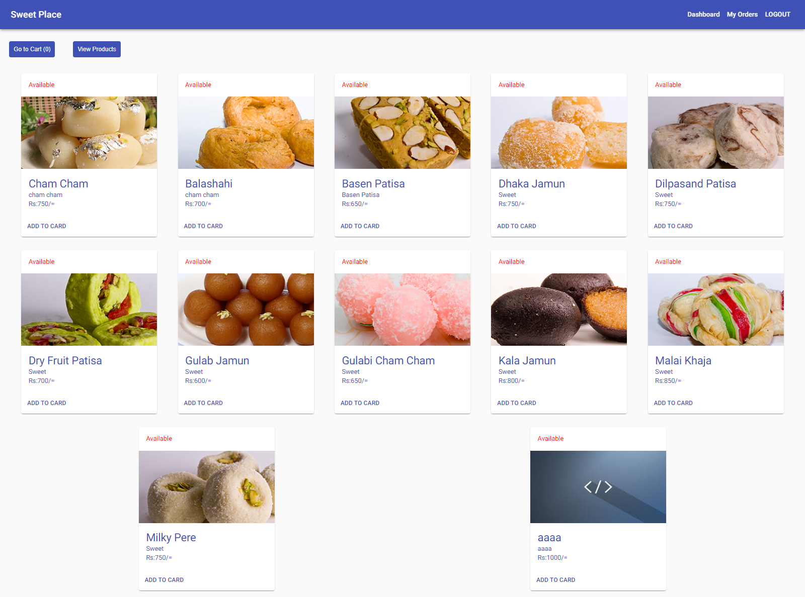
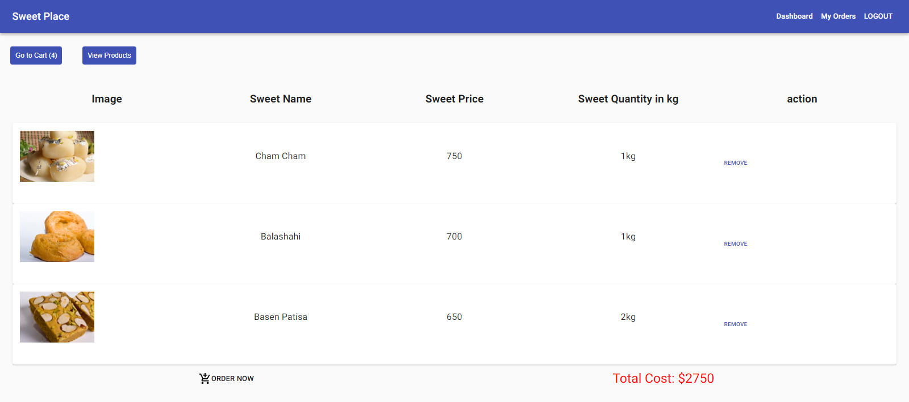
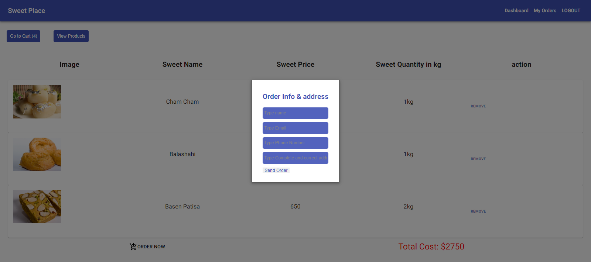
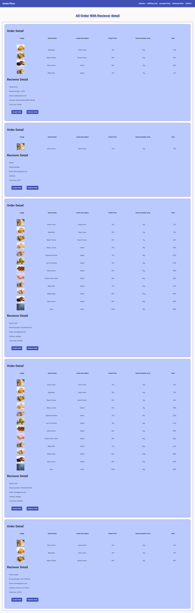
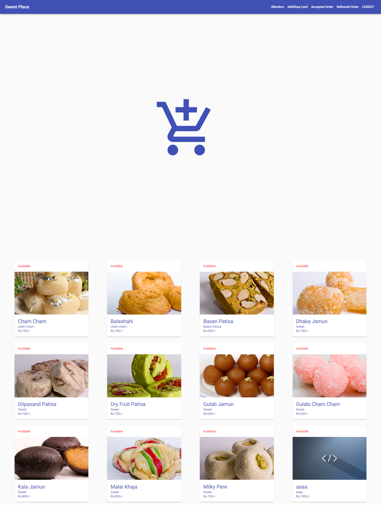
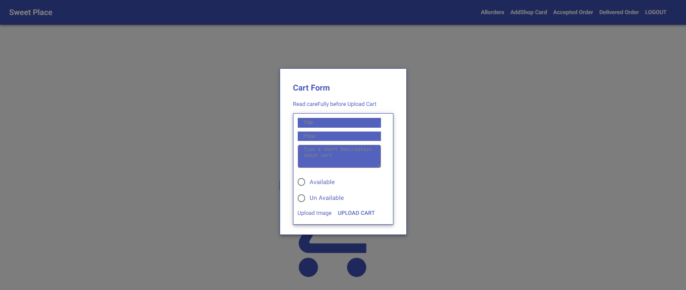
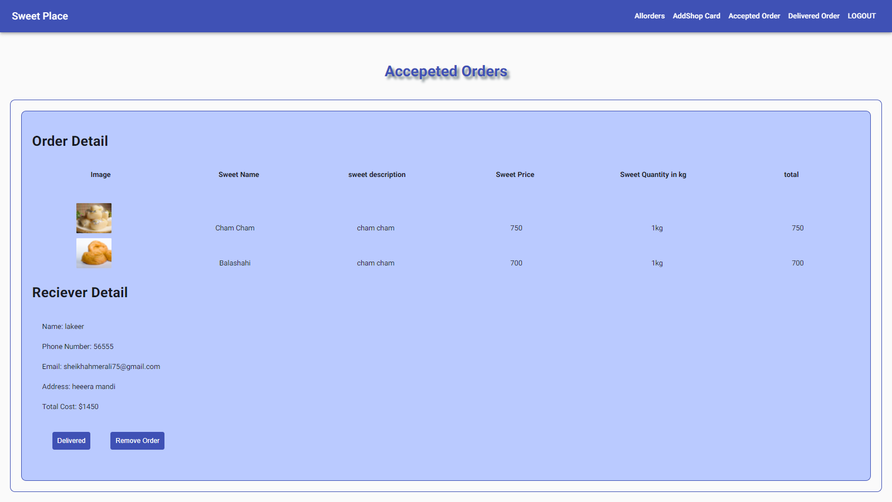
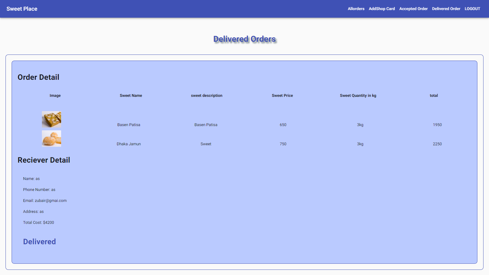

# **Sweet Shop**
### I create sweetSop where user can Register and Login this app created using **`react.js ` `matetial-ui`  `Express`** and **`mongodb`**  is Using for database
And it is fully responsive **`Mobile`, `Tablet`, `Desktop`** please check out this app blew the link 

## _Visite This App From This Link_

[https://new-sweet-app.herokuapp.com/](https://new-sweet-app.herokuapp.com/)

# What can to admin and User 
1. # User Functionality
   1. User can `Register`
   2. User can `Login` 
   3. User can do `Order` 
   4. user can see `his Ordrs` and see status, Which is status of his product Order in `rewiew` or `accepted` or `Delivered`

2. # Admin functionality

   1. Admin can see `All Order`
   2. Admin can `Accept` Order
   3. Admin can `Delete` Order 
   4. And Admin can change order Status `Review` into `Accepted` into `delivered`
   5. Adming can Upload A sweet cart from admin pannel

# **Application Snapshot**

## **Login Screen**

User can Login From This Screen

## **SignUp Screen**

User can signUP form this Screen

## **Home page**

This is Home Page where all sweet will show

## **Add to cart screen**

All All added product by the click Add to cart

## **Order Detail Form**

User will add order Address and other detail

## **All Order**

All order Will show here who are sending form userInterface

## **upload Product or add product**

Admin can Uplaod from here and see all uploaded Product

## **This is Accepted order Screen**

After accept order screen will show like this 

## **This is Delivered order Screen**

After change status accept into delivered screen will show like this 

# Author 
_Muhammad Zubair_

Email : muslimsteacher@gmail.com

 
# ======================  Thank You ======================

supported node version 16.20.2
